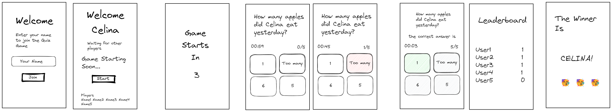

# quizzy

Quizzy is a Python Flask-based multiplayer quiz web app ready to run in container mode for reliable, streamlined deployment locally or a cloud provider such as AWS.

## Table of Contents

- [Installation](#installation)
- [Usage](#usage)
- [Notes over structure](#notes-over-structure)
- [Contributing](#contributing)
- [License](#license)
  
## Installation

### To install quizzy locally in dev environment:

  1. ### Install Python & Pipenv
     Excellent instructions for installing Python on various operating systems available at:  
     [https://realpython.com/courses/installing-python-windows-macos-linux/](https://realpython.com/courses/installing-python-windows-macos-linux/)
     
     Once Python is installed, we recommend installing Pipenv using pip:
     ```shell
     $ pip install --user pipenv
     ```
  
  3. ### To enter the virtual environment
      ```shell
      $ pipenv shell
      ```
  
  4. ### Install the required dependencies:
      ```shell
      $ pipenv install -r requirements.txt
      ```
      
  5. ### Create a .env file in the quizzy directory and add a variable "SECRET_KEY" with your random token as a the value.
      ```
      SECRET_KEY=<YOUR RANDOM TOKEN HERE>
      ```
      
  6. ### Start the server with the following command:
      ```shell
      $ python3 wsgi.py
      ```

### To install and run quizzy containers in production mode using Docker:

1. ### Install Docker
   
2. ### Run docker-compose up from the parent project directory:
   ```shell
   $ sudo docker-compose up
   ```

3. ### To stop run docker-compose down:
   ```shell
   $ sudo docker-compose down
   ```

## Usage

### While in dev testing, naviate your browser to the localhost port 6002 (i.e. http://localhost:6002)

### In production mode, navigate your browser to server IP address (i.e. http://192.168.1.10)

https://github.com/mdelgadonyc/quizzy/assets/17136771/c887c4ee-49e4-4ff8-b328-eb7093c47cde


## Notes over structure



## Contributing

Please open an issue to suggest fixes or ideas for improving quizzy.

## License

[The GNU General Public License v3.0](https://www.gnu.org/licenses/gpl-3.0.en.html)
